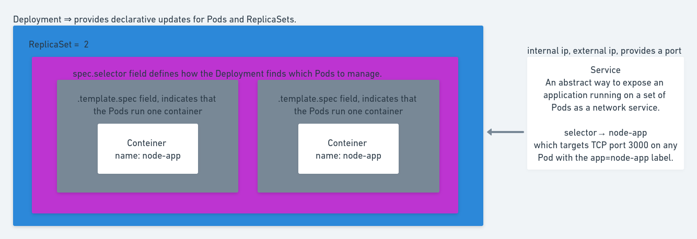

# CREATE IMAGE FOR DOCKERHUB
	sudo docker tag kubenetes-nestjs-mysql_app andremaria1980/kubenetes-nestjs-mysql:kubenetes-nestjs-mysql_app
	sudo docker push andremaria1980/kubenetes-nestjs-mysql:kubenetes-nestjs-mysql_app

# Exemple install minikube 
	https://kubernetes.io/blog/2019/03/28/running-kubernetes-locally-on-linux-with-minikube-now-with-kubernetes-1.14-support/

	minikube start --vm-driver kvm2
	minikube config set vm-driver kvm2
	minikube start

# Configuration
	kubectl apply -f <NAME_FILE>.yaml  
	kubectl delete -f <NAME_FILE>.yaml 

# Deploy app mysql
	kubectl apply -f kube/env-configmap.yaml
	kubectl apply -f kube/static-files-persistentvolumeclaim.yaml
	kubectl apply -f kube/mysqldbkube-deployment.yaml
	kubectl apply -f kube/mysqldbkube-service.yaml
	kubectl apply -f kube/db-persistentvolumeclaim.yaml
	kubectl apply -f db-persistentvolumeclaim.yaml

# Deploy app nestjs
	kubectl apply -f kube/app-claim0-persistentvolumeclaim.yaml
	kubectl apply -f kube/app-deployment.yaml
	kubectl apply -f kube/app-service.yaml

	minikube service
	minikube service node-app-service --url

## Verify: 
	kubectl get deployment
	kubectl get pod

## Debugging pods
	kubectl logs <POD-NAME>
	kubectl describe pod <POD-NAME>
	kubectl exec -it <POD-NAME> -- bin/bash

### access database
	kubectl exec -it <POD-NAME> -- bin/bash
	mysql -u root -p

### list database
	SHOW DATABASE;

# Deploy app Redis
kubectl apply -f kube/env-configmap.yaml
kubectl apply -f kube/cache/cache-persistentvolumeclaim.yaml
kubectl apply -f kube/cache/cache-deployment.yaml
kubectl apply -f kube/cache/cache-service.yaml

### fix Got permission denied while trying to connect to the Docker daemon socket at unix:///var/run/docker.sock: Post
sudo chmod 666 /var/run/docker.sock